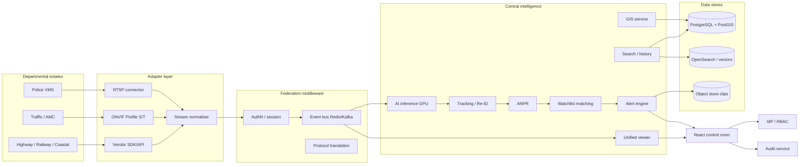

# GUSIP Architecture

## Component diagram



## Process view (PoC containers)

| Service | Image / role | Ports |
|---|---|---|
| `postgres` | PostGIS 16 | 5432 |
| `redis` | Event bus + live cache | 6379 |
| `minio` | Evidence object store | 9000/9001 |
| `backend` | FastAPI: registry, GIS, search, alerts, WS, audit | 8000 |
| `worker` | Adapters + simulator / inference loop | — |
| `frontend` | Nginx + React | 8080 |
| `redpanda` | Optional Kafka API (`compose --profile full`) | 19092 |

## Module map (source)

| SRS layer | Code |
|---|---|
| Adapter layer | `backend/app/workers/adapters.py` |
| Inference | `backend/app/workers/inference.py` |
| Simulator (own + gov-style feeds) | `backend/app/workers/simulator.py` |
| Federation bus | `backend/app/services/event_bus.py` |
| Tracking / Re-ID | `backend/app/services/tracking.py` |
| Watchlist / alerts | `backend/app/services/matching.py` |
| Pipeline | `backend/app/services/pipeline.py` |
| GIS / gaps | `backend/app/services/gis.py` |
| Control room | `frontend/src/pages/*` |

## Event contract

```json
{
  "camera_id": 1,
  "timestamp": "2026-08-18T04:00:00+00:00",
  "event_type": "anpr",
  "object_type": "vehicle",
  "plate_number": "GJ 01 ST 0001",
  "confidence": 0.94,
  "bbox": {"x": 80, "y": 60, "w": 120, "h": 70},
  "attributes": {"color": "white", "vehicle_class": "suv", "source_type": "rtsp"}
}
```

This contract is identical for simulated, RTSP-sampled, ONVIF, and vendor-API paths.

## Network segmentation (production)

- **Zone A** – departmental VMS (unchanged)
- **Zone B** – adapter DMZ (mTLS, allowlisted IPs, no inbound from internet)
- **Zone C** – intelligence cluster (GPU + Kafka + DB)
- **Zone D** – control-room VLAN (console only)

PoC compose uses a single bridge network; Kubernetes manifests introduce namespaces `gusip-ingest` and `gusip-intel` as the first split.

## Video handling

Unified viewer in PoC renders **metadata-overlay tiles** (codec/source badge + live bbox) rather than ingesting 50 full bitstreams. This matches NFR-6 and is how a 80k design stays affordable: decode/AI on regional GPU farms; the statewide console mostly sees events + on-demand proxy.

On-demand relay (production): MediaMTX / GPU transcode pool requested by `camera_id` with RBAC and audit.

## Failure modes

| Failure | Behaviour |
|---|---|
| One VMS down | Those cameras `offline`; others unaffected |
| Worker crash | Compose/K8s restarts; bus retains recent events |
| DB unwritable | Alerts still publish on bus (best-effort); durable write retried |
| UI disconnect | WebSocket resubscribe; REST snapshot of inbox |
